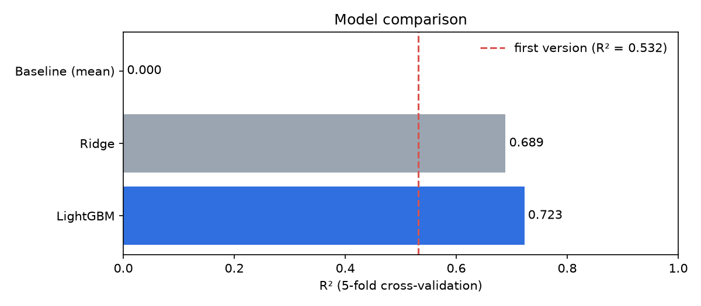
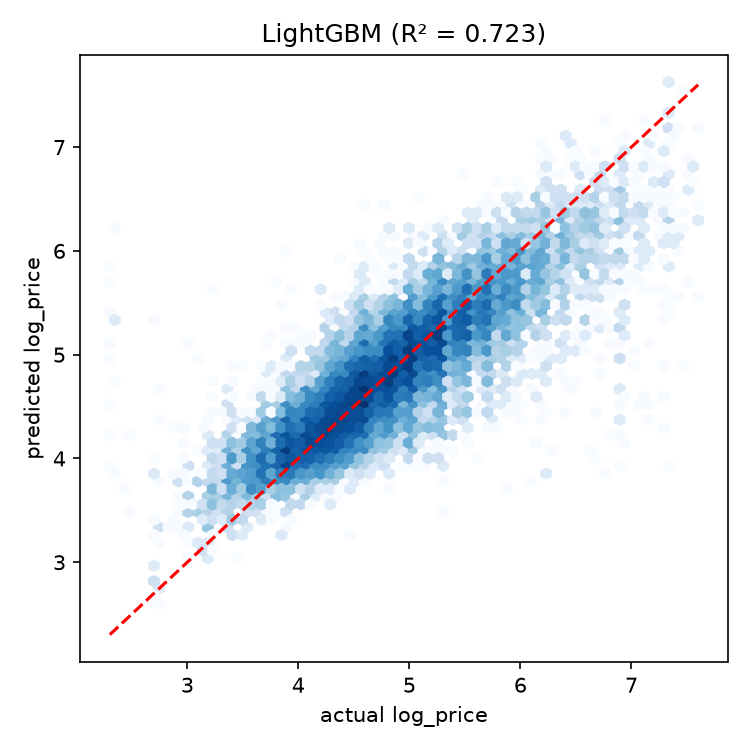
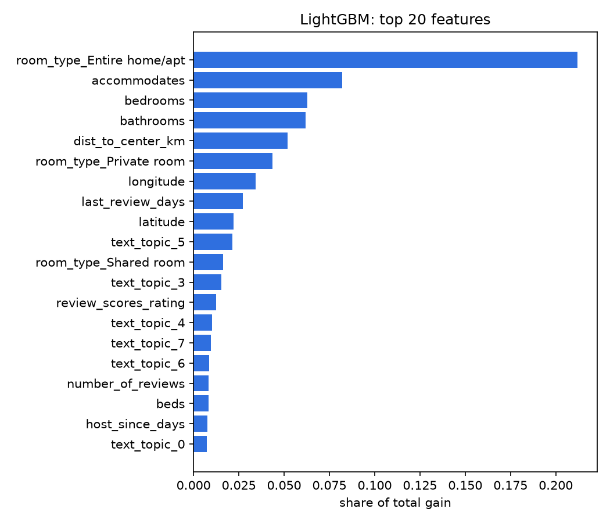

# Airbnb price prediction

The goal is to predict the price of an Airbnb listing (as `log_price`) from its characteristics: type of property, host, reviews, location, amenities and description. The data covers 6 US cities (NYC, LA, SF, DC, Chicago, Boston).

This started as a project for our *Programming for Data Science* course at ESILV (2026), which I did with Hela Mouakhar. Our first version reached R² = 0.53. After the course I reworked it, and the current version gets **R² = 0.72** in 5-fold cross-validation.

The original notebook (in French) is still here: [`notebooks/v1_course_project_FR.ipynb`](notebooks/v1_course_project_FR.ipynb).



## What I changed from the first version

Looking back at v1, there were a few problems:
- we used the listing `id` as a feature
- we dropped the amenities, the descriptions and the dates, even though they carry a lot of information
- categories were encoded with `LabelEncoder`, which gives them an arbitrary order
- we applied a PCA before tree-based models, which loses information
- everything was evaluated on a single train/validation split

In v2:
- amenities are split into one column per amenity, and `name` + `description` go through a TF-IDF
- dates become durations (how long the host has been on Airbnb, how long since the last review)
- I added the distance from each listing to its city's downtown
- categories are one-hot encoded
- the preprocessing is inside a scikit-learn `Pipeline`, so it is refitted inside each fold of the cross-validation
- the model is LightGBM, compared with a Ridge regression

## Results

5-fold cross-validation, on `log_price`:

| Model | RMSE | R² |
|---|---|---|
| Predict the mean | 0.719 | 0.00 |
| v1 (Gradient Boosting after PCA, single split) | – | 0.53 |
| Ridge | 0.401 | 0.69 |
| LightGBM | 0.379 | 0.72 |

<p align="center">
  
  
</p>

Some things I found interesting:
- Room type is by far the most important feature, then size (capacity, bedrooms, bathrooms) and the distance to downtown.
- The text helps a lot: even a simple Ridge model on the TF-IDF gets close to LightGBM.
- The model is worst in DC (RMSE 0.50 vs 0.35 in NYC). Among the words most linked to high prices are "inauguration" and "super bowl". Some DC listings were clearly priced for the January 2017 inauguration, not at their normal rate.

More plots and the error analysis are in [`notebooks/airbnb_price_prediction.ipynb`](notebooks/airbnb_price_prediction.ipynb).

## How to run it

```bash
pip install -r requirements.txt
# put airbnb_train.csv and airbnb_test.csv in data/ (see data/README.md)
python src/train.py
```

`src/features.py` has the feature engineering. `src/train.py` runs the cross-validation, makes the figures and writes the test predictions to `results/predictions.csv`.

## Ideas for later
- tune the LightGBM hyperparameters
- try sentence embeddings instead of TF-IDF
- use the prices of the nearest listings as a feature
